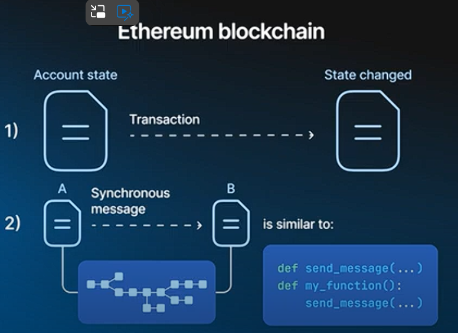

2\. Ethereum (Second Generation)
--------------------------------

### Key Improvements:

-   Generalizes Bitcoin's concept
-   More flexible for developers

### Account Structure:

-   Accounts can have arbitrary internal storage
-   Transactions can transition account state

### Smart Contract Capability:

-   Accounts can communicate synchronously
-   Functions as a "Global computer"

### Developer Experience:

-   Familiar programming paradigm
-   Compatible with known tools

### Scalability Issues:

-   Requires storing entire blockchain state on each node
-   Sequential transaction processing
-   
