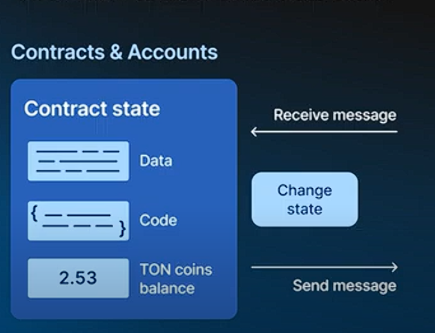
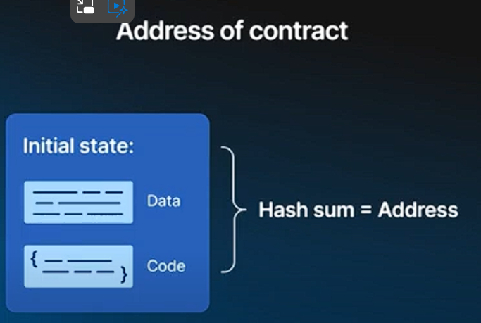
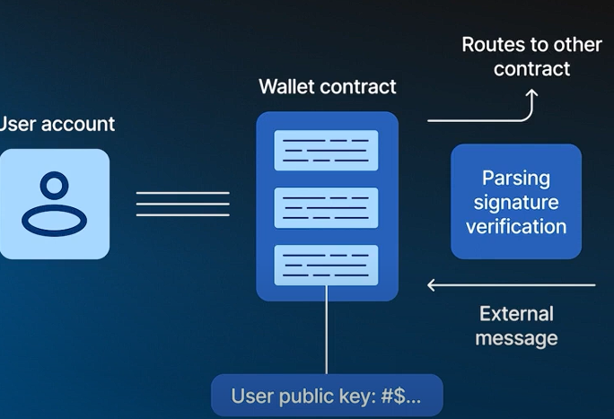
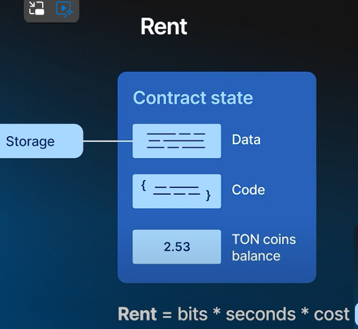
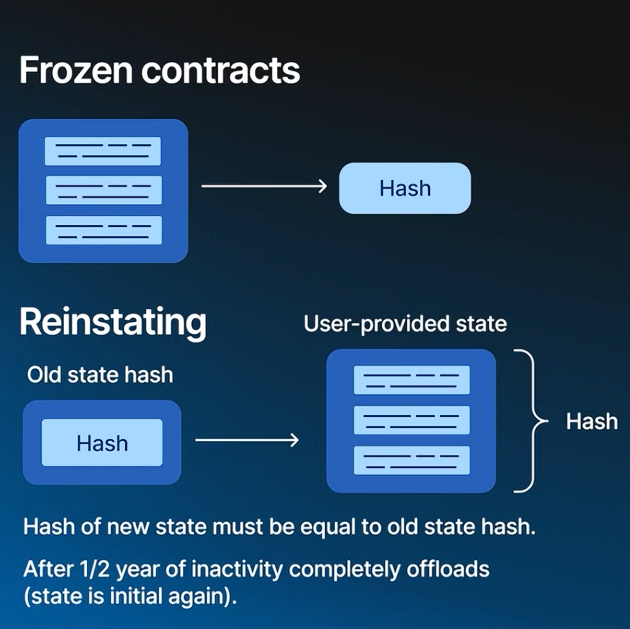

### **Comprehensive Summary of Lesson Four: Accounts and Contracts in TON**

* * * *

#### **1\. Overview of Accounts and Contracts:**

-   **Interchangeable Terms:** In TON, "accounts" and "contracts" are often used interchangeably.
-   **Components of Contracts:** Contracts in TON are built from three basic components: data, code, and TON coin balance.
-   **Functions:** Contracts receive incoming messages, process them, emit outgoing messages, and update their internal state.

#### **2\. Contract Structure:**

-   **Address Identification:**
    -   A contract's address is a cryptographic hash of its initial data and code.
    -   The address remains constant even as the contract's state changes.
-   **Locality:**
    -   Each contract's data is encapsulated, meaning a contract only sees its own storage and balance.
    -   Changes to one contract are independent of changes to others, which is crucial for the scalability of TON.

#### **3\. Types of Contracts:**

-   **Wallet Contracts:**
    -   Every user account in TON is a custom wallet contract.
    -   The wallet contract's main role is to verify signatures and route messages to other contracts.
-   **Multi-Signature Contracts:**
    -   Operated by multiple user wallets, these contracts handle tasks like unlocking funds or executing specific actions after verifying multiple signatures.
-   **Token Contracts:**
    -   Tokens in TON are separate contracts with their own state and attributes, such as ownership.
    -   To transfer a token, a message is sent to the token contract to update its owner attribute.

#### **4\. Contract Fees and Costs:**

-   **Gas Costs:**
    -   Every instruction executed by a contract incurs a gas cost.
    -   The cost is deducted from the contract's balance, and execution halts if the balance reaches zero.
-   **Rent Costs:**
    -   Contracts pay rent for storing data over time, which is deducted from the contract's balance.
    -   Rent is calculated based on the contract's data size and duration.
    -   When a contract makes a transaction after a long period of inactivity, the first transaction may have a higher fee due to accumulated rent.

#### **5\. Handling Frozen Contracts:**

-   **Frozen Contracts:**
    -   If a contract runs out of funds due to rent, it becomes frozen, and its data is replaced with a cryptographic hash.
    -   To unfreeze, the user must provide a snapshot of the data that matches the hash.
    -   Frozen contracts can be completely offloaded after approximately six months, resetting the contract's state to its initial one.
-   **Impact on Tokens:**
    -   If a token contract is offloaded, its ownership state resets, causing the current owner to lose access to the token.