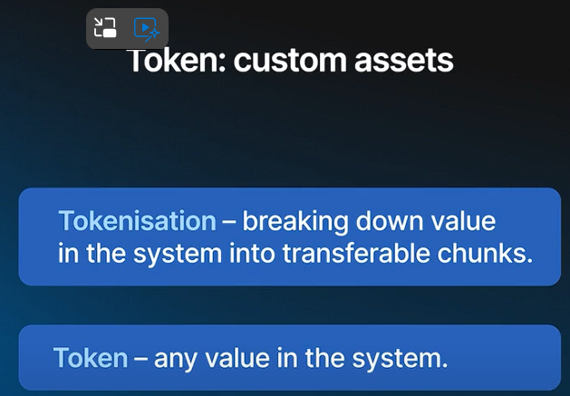
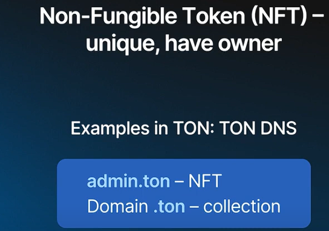
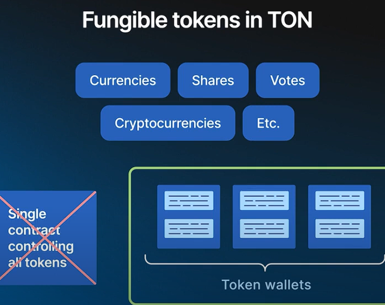

#### **1\. Introduction to Tokens:**

-   **Custom Assets:** In the TON platform, you can create custom assets known as tokens. These assets can represent anything of value that can be transferred within your application, such as currencies, stablecoins, tickets, receipts, or financial contracts.
-   **Tokenization:** The process of breaking down value stored in your system into transferable chunks is called tokenization.

#### **2\. Types of Tokens:**

-   **Fungible Tokens:**
    -   **Definition:** Tokens that can be split, merged, and interchanged. They represent items like currencies, shares, or units of value that are interchangeable.
    -   **Implementation in TON:**
        -   Each user's token balance is stored in a separate contract called a token wallet.
        -   Token wallets communicate directly with each other to transfer tokens.
        -   This architecture enables the scalable handling of tokens, where transactions between different users do not interfere with each other.
        -   **Use Cases:** Representing intermediate states of value, such as money in a delayed transaction or funds under certain conditions.
-   **Non-Fungible Tokens (NFTs):**
    -   **Definition:** Tokens that are unique, have a specific owner, and cannot be split or merged.
    -   **Implementation in TON:**
        -   Used for collectibles, utility tokens, and specific financial agreements.
        -   Examples include TON DNS records and Telegram usernames, where each token is unique and can be transferred between users.
        -   Tokens can also be organized into collections, creating hierarchies or flat lists of independent tokens.
        -   **Use Cases:** Subscriptions, unique financial contracts, ownership management.

#### **3\. Scalability of Tokens in TON:**

-   **Independent Contracts:** In TON, tokens are managed by multiple independent contracts (token wallets), each handling a user's balance.
-   **Scalable Architecture:**
    -   This design allows for scalable token transfers, where transactions are processed independently, avoiding bottlenecks.
    -   Custom assets inherit the full scalability of the TON network, ensuring performance at any scale.

#### **4\. Use of Tokens in Applications:**

-   **Technical Representation:** Tokens can be used to represent different states of value in a system, not just as currencies but also as technical markers for various stages of a transaction.
-   **User Interaction:** Tokens can be displayed to users with additional information (e.g., availability conditions) while keeping the system scalable.
  

**Implementation of Fungible Tokens**

-   Unlike other blockchains, TON does not have a single contract that keeps track of all accounts that own portions of a token
-   Instead, there are multiple independent contracts with the same code, called token balances or token wallets
-   Each user's wallet communicates directly with their own token wallet, which passes messages to increment or decrement token amounts

**Scalability of Tokens**

-   The architecture of TON's token implementation allows for full scalability of tokens
-   This means that transactions of the same token between different users do not interfere with each other
-   The scalability of tokens is one of the most important features of the TON platform