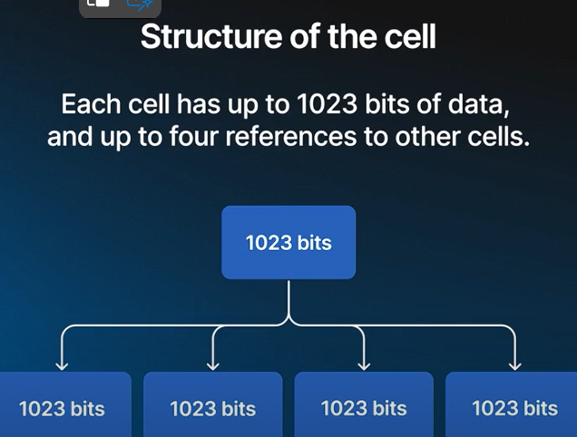
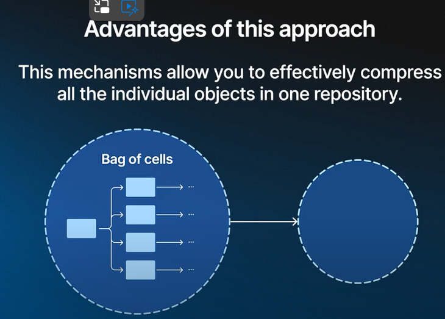
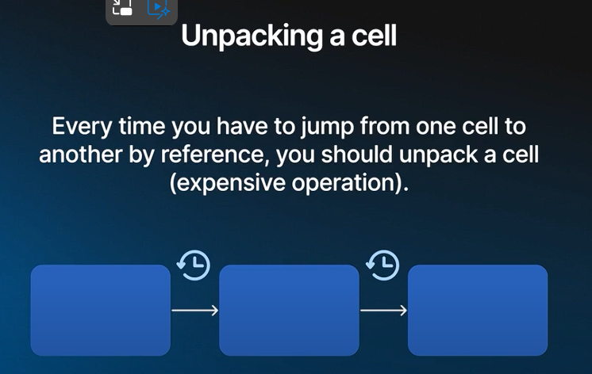

I. Cells: The Fundamental Building Block
----------------------------------------

### Definition:

-   Small building blocks for all data structures in TON blockchain
-   Used in smart contracts and standard data structures

### Characteristics:

-   Up to 1023 bits of data
-   Up to four references to other cells

### Advantages:

-   Allows building of complex and nested data structures
-   Enables efficient merkle proofs for any portion of blockchain data
-   

II. Bag of Cells
----------------

-   Format for transmitting and storing cell data
-   Similar to Git's object storage system
-   Enables de-duplication and compression

III. Smart Contract Execution
-----------------------------

### Process:

1.  Contract storage represented by a cell
2.  TVM (TON Virtual Machine) instantiated upon receiving a message
3.  TVM loads contract state and code (stored in cells)
4.  TVM executes code, verifying network rules and gas costs
5.  TVM returns either an error or new contract state
6.  TVM emits list of outgoing actions (typically messages)

### TVM Characteristics:

-   Stack-based virtual machine
-   Designed for TON bytecode execution
-   Lightweight, instantiated for each message

IV. Data Types in TVM
---------------------

1.  Cells
2.  Integers (including 257-bit integers for cryptographic and financial operations)
3.  Tuples

V. Memory Layout in Contracts
-----------------------------

### Challenges:

-   Limited to tree of cells
-   Storing complex data structures (lists, dictionaries, sets) not trivial

### Solutions:

-   TVM and FunC (high-level language) provide tools for working with hashmaps
-   Hashmaps implemented as prefix trees using cells

### Considerations:

-   Logarithmic cost for data access
-   Scalability limited within individual contracts
-   High cost for nested cell references ("unpacking")

VI. Handling Large Data Sets
----------------------------

### Recommendations:

-   Use nested cells for small amounts of data
-   For systems with millions of users:
    -   Use tokens to represent user participation
    -   Avoid storing large user lists in contracts

VII. Cell Hashing Scheme
------------------------

-   Deterministic hashing for unique cell identification
-   Used for data deduplication and compression
-   Enables contract state preservation via storage cell hash