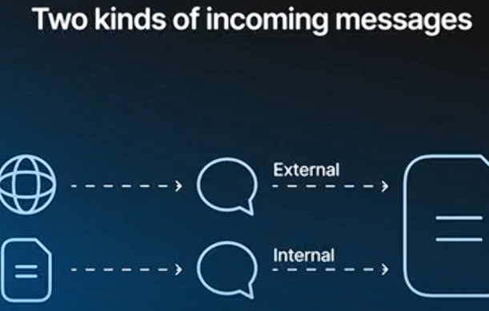
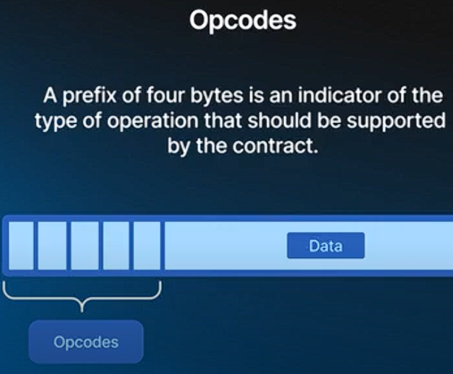

### **Types of Messages in TVM**

-   **Incoming Messages:**

    -   **External Messages:**
        -   **Nature:** A string of data from an unspecified source.
        -   **Characteristics:**
            -   Not authenticated by itself.
            -   No attached TON coins.
            -   Can contain any data defined by the contract author.
            -   The contract is responsible for parsing and processing this data.
    -   **Internal Messages:**
        -   **Nature:** Sent by contracts to other contracts.
        -   **Characteristics:**
            -   Can carry balances.
            -   Authenticated by the sender's contract address.
            -   TON architecture guarantees the sender's address authenticity.
-   **Message Handlers:**

    -   Separate handlers for internal and external messages.
    -   Messages contain arbitrary payload data defined by the contract author
 

### **Operation Codes (Op Codes)**

-   **Purpose:** Used to differentiate types of messages within a contract.
-   **Format:**
    -   A prefix of four bytes in the message data.
-   **Usage:**
    -   Standard wallet and token implementations use various op codes.
    -   Commonly based on sequence numbers (e.g., operation 1, 2, 3) or CRC32 code of the message description.
    -   Helps extend contract features without conflicts.

* * * *

### **Understanding Transactions**

-   **Definition:**
    -   A transaction is a set of changes to the state of a contract.
    -   A message is the input to a transaction, but not a transaction itself.
-   **Transaction Outcome:**
    -   Changes the contract's state.
    -   Creates a new state and a list of outgoing actions.

* * * *

### **Phases of a Transaction**

1.  **Storage Phase:**

    -   **Objective:** Charge the contract rent for its existence.
    -   **Mechanism:**
        -   Rent is calculated based on a price per bit per second.
        -   If the contract lacks funds, execution aborts, and the contract is frozen.
        -   Frozen contracts remain inactive until unfrozen by their owner.
2.  **Credit Phase:**

    -   **Objective:** Credit the contract with coins attached to the incoming message.
    -   **Note:**
        -   Applies only to internal messages (as external messages do not carry coins).
3.  **Computation Phase:**

    -   **Objective:** Execute the contract code.
    -   **Mechanism:**
        -   TVM executes the code and monitors gas usage.
        -   The gas limit can be adjusted based on the message source or the contract's balance.
        -   Proper gas management ensures the contract does not run out of funds during execution.
4.  **Action Phase:**

    -   **Objective:** Process the contract's new state and outgoing messages.
    -   **Key Actions:**
        -   Create and record a new state.
        -   Route outgoing messages to other contracts.
        -   Example: A wallet contract may send coins to another wallet address.
5.  **Bounce Phase:**

    -   **Objective:** Handle transaction failures.
    -   **Mechanism:**
        -   If a failure occurs and the message is bounceable, remaining funds are returned to the sender.
        -   Bounce behavior can be a safety feature or a contract-specific functionality.