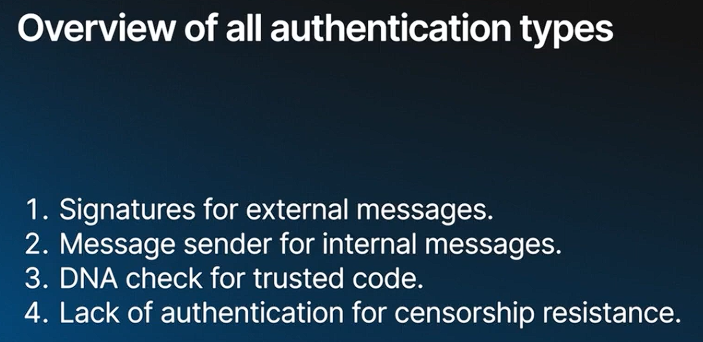
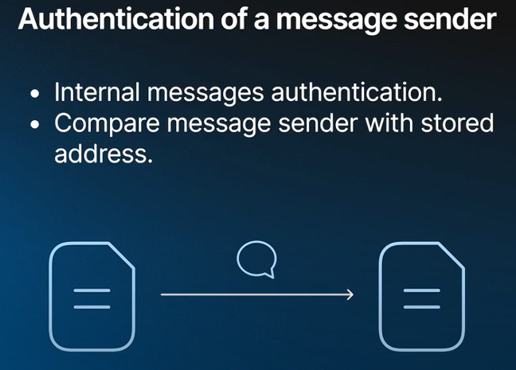
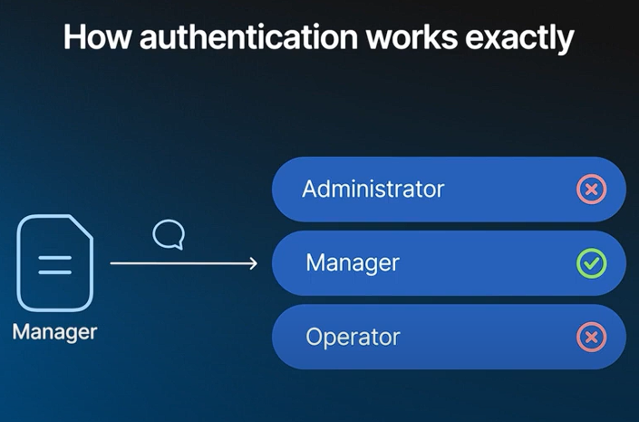
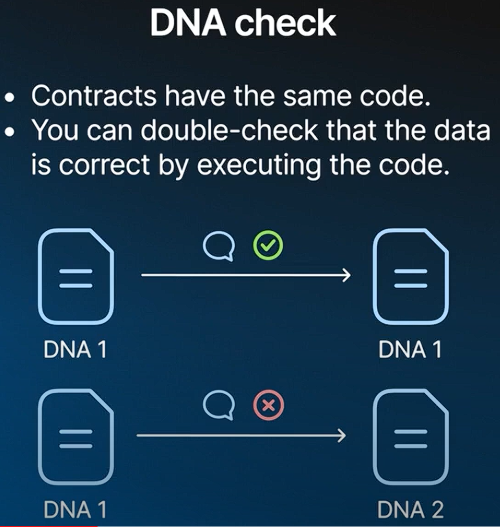
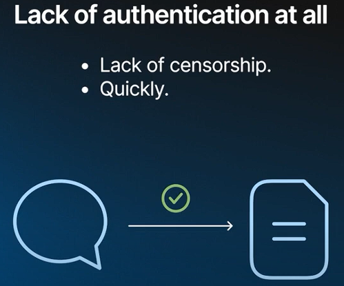

### **1\. Classic Authentication with a Signature**

-   **External Messages:**

    -   **Nature:** External messages are unauthenticated by themselves; they are simply raw data arriving at a contract.
    -   **Common Use Case:**
        -   Wallet contracts are typical recipients of external messages.
        -   Wallet contracts handle:
            -   **TON Coin Balance:** Stores user's coin balance.
            -   **Sequence Number:** Prevents replay attacks.
            -   **Public Key:** Used for signature verification.
-   **Process:**

    -   The wallet reads a 64-byte signature from the incoming message.
    -   Verifies the signature using the stored public key.
    -   If verified, the message is processed further, typically sending instructions to other contracts within the blockchain.
-   **Design Note:**

    -   Classic signature-based authentication is primarily reserved for wallets.
    -   Internal messages are preferred for inter-contract communication due to their flexibility and composability.

* * * *

### **2\. Authentication by Message Sender**

-   **Internal Messages:**

    -   **Nature:** Internal messages are authenticated by the sender's contract address.
    -   **Security:** TON protocol ensures the sender's address is secure and accurate.
-   **Advantages:**

    -   **Flexibility:** Not limited to human users; contracts can interact programmatically.
    -   **Use Cases:**
        -   A token's owner could be another contract, such as:
            -   A wallet contract.
            -   A multi-signature vault.
            -   A decentralized exchange.
    -   **Authentication Process:**
        -   The handler checks the sender's address against stored addresses (e.g., admin, manager) to determine the role triggering the message.
-   **Benefits:**

    -   **Efficiency:** Cheaper and more flexible than signature verification.
    -   **Composability:** Facilitates complex contract setups.

* * * *

### **3\. DNA Check (Code-Based Authentication)**

-   **Concept:**

    -   Addresses in TON are cryptographic hashes of the contract's initial code and data, making them secure identifiers.
    -   Contracts can authenticate each other by verifying that the sender's code matches their own.
-   **Use Case:**

    -   Common in token contracts with identical code but different data.
    -   Contracts ensure the sender adheres to the same protocol by checking the code's "DNA."
-   **Process:**

    -   The contract computes expected sender data based on trusted code.
    -   Compares this with the actual message sender's data.
    -   If the codes match, the contract trusts the message, ensuring protocol consistency.
-   **Application:**

    -   This method provides a powerful way to verify that interacting contracts are running the same trusted code.

* * * *

### **4\. Lack of Authentication**

-   **Concept:**

    -   **Purpose:** Sometimes, the lack of authentication enhances security, particularly in censorship-resistant systems.
-   **Use Case:**

    -   **Example:** A decentralized staking pool that needs to perform regular payouts.
    -   If the payout trigger message were authenticated, it would centralize control, making the system vulnerable to censorship.
-   **Design Strategy:**

    -   The message handler deliberately omits authentication.
    -   Protection against misuse might involve other mechanisms, such as requiring the sender to cover gas fees.
-   **Benefits:**

    -   **Decentralization:** Allows any user or system to trigger actions, maintaining openness and avoiding single points of control.