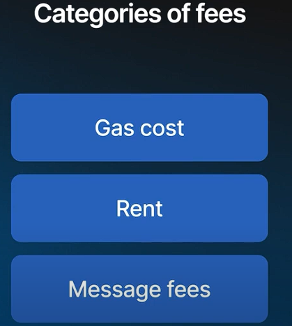
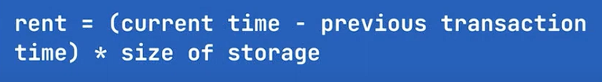
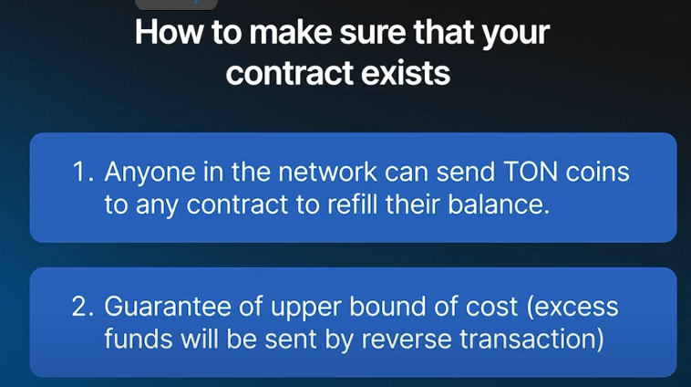

### **Categories of Fees in TON**

1.  **Gas Fees**
2.  **Rent Fees**
3.  **Message Fees**

* * * *

### **1\. Gas Fees**

-   **Concept:**

    -   TON operates as a computational platform where contracts can contain arbitrary code.
    -   The network processes messages running this code, which incurs costs based on computational effort.
-   **Purpose:**

    -   **Payment for Resources:**
        -   Fees are charged for computation to compensate network participants and deter attackers.
    -   **Origin:**
        -   The term "gas" originates from Ethereum, symbolizing the fuel needed for execution.
-   **Mechanics:**

    -   **Operations and Costs:**
        -   Each operation in the code has a specific gas cost.
        -   **Gas Price:**
            -   A global parameter determines the cost of these gas units.
    -   **Price Adjustment:**
        -   Gas prices should adjust based on the market value of TON coins to maintain fair execution costs.
    -   **Execution Process:**
        -   **Instruction Check:**
            -   Each instruction is checked for correctness.
        -   **Balance Deduction:**
            -   The contract's balance is reduced by the incurred gas cost.
        -   **Completion:**
            -   If the balance is sufficient, execution completes.
            -   If not, execution aborts mid-way, collecting any gas payments made.
-   **Design Considerations:**

    -   **Who Pays?**
        -   Typically, the sender of the message covers gas costs, but contracts can also pay for their execution.
    -   **Predictability:**
        -   Contracts should ensure costs are predictable so senders can attach sufficient funds.
    -   **Safety Checks:**
        -   If a contract pays its own gas, extra care is needed to prevent exploitation.

* * * *

### **2\. Rent Fees**

-   **Definition:**
    -   **Storage Costs:**
        -   Rent is the cost for each bit of data stored by the contract per second.
-   **Charging Mechanism:**
    -   **Granularity:**
        -   Calculated per bit per second but charged only during transactions.
    -   **Accumulation:**
        -   Rent accumulates during idle periods and is charged when a new transaction occurs.
    -   **Example:**
        -   A wallet idle for several days incurs rent, leading to a slightly higher fee for the first transaction after the idle period.

* * * *

### **3\. Message Fees**

-   **Overview:**

    -   Fees are charged for creating and importing messages and updating the contract's storage.
-   **Components:**

    -   **Per Message:**
        -   Fees are applied per message and per byte of data.
    -   **Action Phase:**
        -   Occurs during the action phase when the contract generates outgoing messages and updates its state.
-   **Typical Costs:**

    -   Generally low due to the limited amount of data transferred.

* * * *

### **Design Considerations for Smart Contracts**

-   **Avoid Running Out of Gas:**

    -   Ensure contracts do not run out of gas during valid transactions.
-   **Rent Management:**

    -   Prevent contracts from depleting their rent balance, which can freeze operations.
-   **Replenishing Contract Balance:**

    -   Any network participant can send TON coins to refill a contract's balance.
-   **Handling Excess Gas:**

    -   **Predictability:**
        -   If execution costs are unpredictable, senders should attach extra coins to cover potential gas.
    -   **Refund Mechanism:**
        -   Contracts should send any unused gas funds back to the sender or a specified wallet to prevent unnecessary overpayment.
-   **Bounded Execution:**

    -   **Constant Cost Design:**
        -   Strive for constant storage and execution costs to keep rent and gas fees predictable.
    -   **Avoid Variable Length Data:**
        -   Contracts with data structures that grow over time lead to unpredictable costs and potential operational issues.