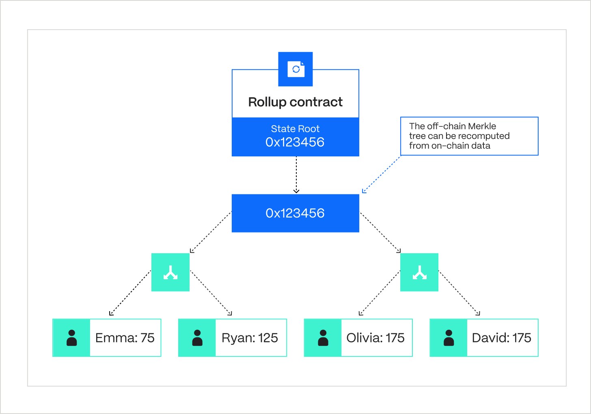
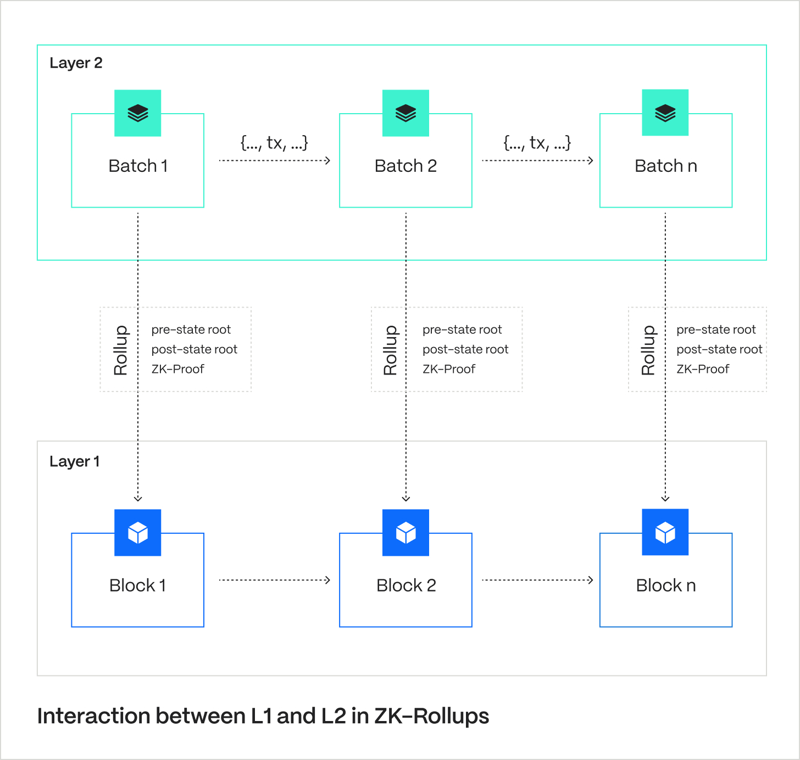
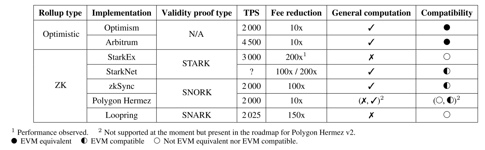

### Key Features Of ZK-Rollups

The most distinctive features of ZK-rollups are **validity proofs** and **on-chain data availability**.

**Validity Proofs:** These are checks done by zero-knowledge proofs, a kind of cryptographic proof that can confirm the result of a calculation quickly and without revealing **certain details of that calculation.** There are various types of these proofs, including [zk-SNARKs and zk-STARKs](https://hacken.io/discover/zk-snark-vs-zk-stark/), which have their own unique properties.

**On-Chain Data Availability:** While the actual transactions are processed off the main blockchain, ZK-rollups ensure some important pieces of data are stored on the main (layer 1) blockchain. This storage is key to the [consensus mechanism](https://hacken.io/discover/consensus-mechanisms/) and makes ZK-rollups general-purpose. With this setup, **anyone can independently verify all the transactions in a rollup**, and it’s even compatible with Ethereum’s Virtual Machine, allowing it to support a wide range of applications.

**Enhanced Security**. A crucial feature of ZK-rollups is a security guarantee that the user can always bring the asset back to layer 1. This is important because other layer 2 solutions don’t offer that guarantee. For example, validiums can lose assets in case of a data availability failure. ZK-rollups won’t face any data availability problems, meaning attackers cannot cause extensive damage. Moreover, data availability removes the need to map assets to owners, which is a great advantage of rollups over other L2 solutions.

How Do ZK-Rollups Work?
-----------------------

At their core, ZK-rollups work through a smart contract on the layer 1 blockchain. This smart contract is crucial as it maintains an authoritative record known as the state root.

**State Root:** The state root is a Merkle tree of batches of information about the rollup’s accounts, balances, and contract code. Users, like the sequencer, publish new batches (a compressed collection of transactions) along with the old and new state roots (pre- and post-state roots). The smart contract then checks the old state root against the current root. If they match, it switches the current version to the new state root.

**Deposits & Withdrawals:** Naturally, rollups have to allow inputs and outputs from the “outside” to enable withdrawals and deposits. The transaction that submits the batch containing “outside” inputs also moves assets to the smart contract. When the transaction submits the batch containing “outside” outputs, the contract initiates the withdrawal process. Hence, the underlying smart contract synchronizes state changes across the base-layer and the rollup.

**Post-State Verification:** How to verify the correctness of the post-state root? Up until now, a malicious actor would have been able to submit any version of the state root (e.g., where they transfer all assets to their account). However, rollups have addressed this issue in two different ways: **validity proofs** and **fraud proofs**. Hence, we have two schemes: zero-knowledge and optimistic rollups.

**Validity Proofs:** ZK-rollups rely on validity proofs to ensure the post-state root contains no manipulations. For that reason, every new batch of transactions comes with a zk-SNARK (or zk-STARK) – an argument of knowledge that proves the batch computation indeed produces the same result as the new state root. And the most important part: even the heaviest computations can be verified quickly on-chain thanks to the highly complex math behind ZK-proofs.

ZK-Rollup vs. Optimistic Rollup
-------------------------------

*   **Key Similarity**: Both ZK-rollups and optimistic rollups store some data on the chain.
*   **Key Difference**: ZK-rollups use validity proofs, while optimistic rollups fraud proofs.

**Verification-Only Data:** ZK rollups eliminate the need to store verification-only data on-chain due to zk-SNARKs, unlike optimistic rollups, which require it for fraud checks.

In ZK-rollups, data that’s only relevant for verification does not need to be stored on-chain because the ZK-proof _implicitly_ confirms that any necessary verification data was provided. In contrast, fraud proofs used in optimistic rollups validate transactions _post-factum_ and require more information. Hence, optimistic rollups store all data relevant for verification on-chain, regardless of the dispute status.

**Privacy Preserving:** ZK-rollups store more transaction details off-chain, which makes them better suited for preserving privacy. In a privacy-preserving withdrawal scenario, an optimistic rollup requires a total of 296 bytes per transaction, combining various elements like the root index, nullifier, recipient information, and a ZK-SNARK proof. This results in a 77x efficiency increase (compared to L1). On the other hand, a ZK rollup needs only 40 bytes per transaction since it doesn’t require the zk-SNARK proof on-chain, leading to a [570x](https://vitalik.ca/general/2021/01/05/rollup.html) increase in efficiency (compared to L1). Both methods are based on a comparable number of transactions (~380,000). Moreover, the gas cost per on-chain transaction is lower for ZK-rollups.

**Gas Cost Per Batch:** Compared to fraud proofs, verifying zk-SNARKs with every batch is costly. ZK-SNARK technology is generally way more complicated and harder for generalizability. Hence, optimistic rollups are cheaper per batch: 40,000 gas vs 500,000 gas.

**Withdrawal Time:** Optimistic rollups delay withdrawals to give enough time (e.g., 7 days) for dispute resolutions. By contrast, ZK-rollups allow for instantaneous withdrawal.

**Application & Real-World Use:** Optimistic rollups are more widespread mostly because they are better suited for general-purpose EVM computation. The total value locked in optimistic rollups is over [$10 billion](https://l2beat.com/scaling/detailedTvl), which is ten times greater than the TVL in ZK-rollups.

