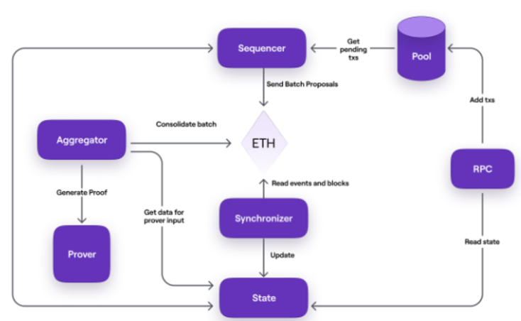
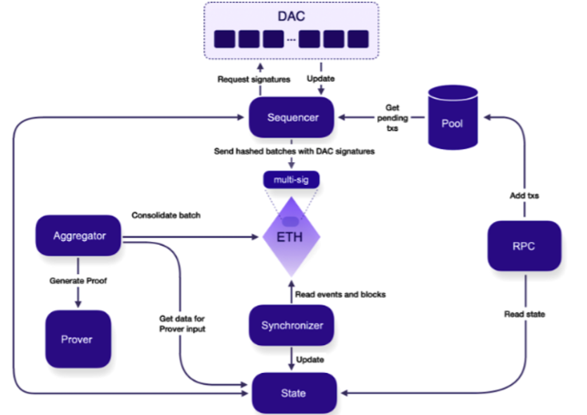
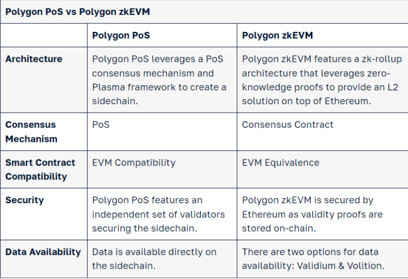

>>>>>  gd2md-html alert:  ERRORs: 0; WARNINGs: 0; ALERTS: 3.

<ul style="color: red; font-weight: bold"><li>See top comment block for details on ERRORs and WARNINGs. <li>In the converted Markdown or HTML, search for inline alerts that start with >>>>>  gd2md-html alert:  for specific instances that need correction.</ul>

Links to alert messages:
<a href="#gdcalert1">alert1</a>
<a href="#gdcalert2">alert2</a>
<a href="#gdcalert3">alert3</a>

>>>>> PLEASE check and correct alert issues and delete this message and the inline alerts.

[https://polygon.technology/ecosystem](https://polygon.technology/ecosystem)

<table>
  <tr>
   <td>
<h3>What is the Data availability committee (DAC)?</h3>

   </td>
  </tr>
  <tr>
   <td>Architecturally speaking, the Polygon CDK validium is a zkEVM with a DAC. 

That is, Polygon CDK validium =<em> Polygon zkEVM + DAC</em>.

Please refer to this article for more information.

https://docs.polygon.technology/cdk/architecture/cdk-validium/#data-availability-committee-dac
   </td>
  </tr>
</table>

<table>
  <tr>
   <td>
<h3>What is a CDK Validium chain?</h3>

   </td>
  </tr>
  <tr>
   <td>Polygon CDK validium uses validity proofs to enforce the integrity of state transitions, but it does not store transaction data on the Ethereum network.

The Polygon CDK validium is in fact a zero-knowledge validium (zkValidium) because it utilizes the Polygon zkEVM’s off-chain prover to produce zero-knowledge proofs, which are published as validity proofs.

The use of the above-mentioned prover, to a certain extent, adds trustlessness to the Polygon CDK validium.

The validium mode inherits, not just the prover, but all the Polygon zkEVM’s components and their functionalities, except that it does not publish transaction data on L1.

The validium configuration has one major advantage over the zkEVM rollup option: And that is, reduced gas fees due to the off-chain storage of transaction data, where only a hash of the transaction data gets stored on the Ethereum network.
   </td>
  </tr>
</table>

<table>
  <tr>
   <td>
<h3>What are the components of CDK?</h3>

   </td>
  </tr>
  <tr>
   <td>Contracts

Sequencer

Synchronizer

State DB

Bridge UI

Executor

RPC Nodes

Aggregator

Bridge Services

DAC

Prover

ethtxmanager
   </td>
  </tr>
</table>

<table>
  <tr>
   <td>
<h3>What is CDK Architecture?</h3>

   </td>
  </tr>
  <tr>
   <td>
<ul>

<li>CDK Rollup \

CDK Validium \

</li>
</ul>
   </td>
  </tr>
</table>

<table>
  <tr>
   <td>
<h3>What is CDK Rollup chain?</h3>

   </td>
  </tr>
  <tr>
   <td>Polygon zkEVM is a zero-knowledge rollup (or zk-rollup) designed to emulate the Ethereum Virtual Machine.

It is a scaling solution to Ethereum as it rolls up many transactions into one batch.

These batches are submitted to the L1, where their integrity is proved and verified before being included in the L1 state.

Proving, verification of batches, and state changes are all controlled by smart contracts.
   </td>
  </tr>
</table>

<table>
  <tr>
   <td>
<h3>Polygon PoS vs Polygon zkEVM?</h3>

   </td>
  </tr>
  <tr>
   <td><a href="https://moralis.io/whats-the-difference-between-polygon-pos-vs-polygon-zkevm/#:~:text=Polygon%20proof%2Dof%2Dstake%20(,parallel%20to%20the%20Ethereum%20mainnet.">What’s the Difference Between Polygon PoS vs Polygon zkEVM? (moralis.io)</a>

   </td>
  </tr>
</table>

<table>
  <tr>
   <td>
<h3>What is a zkNode?</h3>

   </td>
  </tr>
  <tr>
   <td>In zkEVM, in order to run a node in our L2, we need a software called zkNode. The L2 network requires this client to implement the synchronization and to govern the roles of the participants (Sequencers or Aggregators).
   </td>
  </tr>
</table>

<table>
  <tr>
   <td>
<h3>What does "failed to execute the unsigned transaction" error mean?</h3>

   </td>
  </tr>
  <tr>
   <td>This error occurs due to a limitation in zkEVM, a technology used in blockchain networks. The issue arises when there are too many operations or zk resources within zkEVM. In particular, when the number of actions, known as multicalls, goes beyond 195, it can use up all the available zk resources, leading to transaction failures.

To address this error, it's important to optimize the number of multicalls and reduce how often they are used. By doing this, you can prevent excessive resource consumption, avoid encountering this limitation, and ensure that your transactions run smoothly.
   </td>
  </tr>
</table>

<table>
  <tr>
   <td>
<h3>Can I run my own zkEVM setup on top of Polygon's Hermez zkEVM chain (deploy it as L3) instead of deploying it directly onto Ethereum mainnet (as a parallel L2)?</h3>

   </td>
  </tr>
  <tr>
   <td>While it is possible to run a zkEVM on top of Polygon's Hermez zkEVM chain (as L3), it may involve additional complexities for asset withdrawal compared to zkEVM deployed directly on Ethereum mainnet (as L2). 

The recommended approach is to use Supernets as the L3 solution for simplicity and withdrawal efficiency. zkEVM and Supernets differ in terms of centralization and where assets are secured. If you opt for zkEVM as L3, you would need to withdraw assets from L3 to L2 and then from L2 to L1, adding extra consensus requirements. Ideally, is you use zkEVM for L3, you would also prefer using a zkEVM for L2.
   </td>
  </tr>
</table>

<table>
  <tr>
   <td>
<h3>What is the finality period for transactions on Polygon zkEVM for Goerli and Mainnet?</h3>

   </td>
  </tr>
  <tr>
   <td>Polygon zkEVM achieves finality in three stages, each with different timeframes for transactions.

For users conducting transactions within the rollup (on the Polygon network), finality is achieved lightning-fast, typically within 2 - 3 seconds. This means that transactions within the rollup are confirmed and considered irreversible within a very short time.

However, for users who are bridging funds back to the Ethereum Mainnet, the transaction must reach the third and final stage of finality. In the current Mainnet Beta phase, this process is expected to take approximately 30 - 60 minutes. During this period, the transaction undergoes verification and validation processes to ensure its security and correctness before becoming fully settled on the Ethereum Mainnet.
   </td>
  </tr>
</table>

<table>
  <tr>
   <td>
<h3>I am going to execute millions of transactions in zkEVM. Is there any way to optimize the gas cost?</h3>

   </td>
  </tr>
  <tr>
   <td>Absolutely! Optimizing gas costs is crucial when dealing with a large number of transactions. Here are some strategies to help you achieve gas efficiency:

Batch Transactions: Combine multiple transactions into a single batch transaction. This can be done using Ethereum's "contract calls in a single transaction" or EIP-2711 (multiple transactions in a single call). By bundling multiple operations together, you can eliminate redundant gas costs and reduce the overall gas consumption.

Gas-Efficient Contracts: Design your smart contracts with gas efficiency in mind. Minimize unnecessary storage operations, utilize events for off-chain data access, and implement gas-saving techniques like state channels or rollups if they are applicable to your use case.

Gas Estimation: Accurately estimate the gas limits for each transaction to avoid overestimating and consuming unnecessary gas. Use gas estimation libraries or simulators to determine the optimal gas limits for your specific transactions.
   </td>
  </tr>
</table>

<table>
  <tr>
   <td>
<h3>Why am I getting a rejection error when using "eth_call" on L2 (zkEVM) for contract creation?</h3>

   </td>
  </tr>
  <tr>
   <td>eth_call doesn't support state override at the moment. 

Here you will find the list of all supported JSON RPC endpoints and any differences between them in comparison to the default behavior of an ethereum node.

<a href="https://github.com/0xPolygonHermez/zkevm-node/blob/develop/docs/json-rpc-endpoints.md">https://github.com/0xPolygonHermez/zkevm-node/blob/develop/docs/json-rpc-endpoints.md</a>
   </td>
  </tr>
</table>

<table>
  <tr>
   <td>
<h3>How does the LxLy Bridge work in general?</h3>

   </td>
  </tr>
  <tr>
   <td>LxLy is basically a tool that allows users to bridge assets between L1( Ethereum) and L2 (Polygon zkEVM). It's a marvel of blockchain interoperability.  The LxLy bridge's modular design enables its deployment across various chains, ensuring a versatile bridge for L1 to L1, L1 to L2, L2 to L2, L2 to L3, and so on.

The overall process involved in LxLy is:
<ol>

<li>Deposit on L1: 
<ol>
 
<li>You start by sending assets to a special contract called PolygonZkEVMBridge on Ethereum L1.
 
<li>You specify details like the destination network (L2), your L2 address, the amount of assets, and the token contract address.
 
<li>Inside the contract, it checks if the destination is valid and handles Ether and ERC-20 tokens differently.
</li> 
</ol>

<li>Updating Records: 
<ol>
 
<li>The contract keeps records of your deposits and ensures their security.
 
<li>If necessary, it updates a global record to show your assets are ready to move.
</li> 
</ol>

<li>Transaction to L2: 
<ol>
 
<li>After a while, the records are updated on L2, often through a Sequencer.
 
<li>The L2 network checks this update, confirming your assets are now ready on L2.
</li> 
</ol>

<li>Claim on L2: 
<ol>
 
<li>You can then prove that the assets are yours on L2 by providing proof.
 
<li>You submit a transaction on L2 to claim your assets using the PolygonZkEVMBridge contract.
</li> 
</ol>

<li>Completion: 
<ol>
 
<li>The contract checks your proof and ensures the assets haven't been claimed before.
 
<li>It transfers your assets (Ether or tokens) accordingly.
 
<li>An event confirms the successful claim and your assets are now on L2

I

In summary, the LyLx Bridge is a versatile solution for connecting different blockchain networks, and it operates through a series of steps involving smart contracts, records, and verification mechanisms.

GitHub repo for LyLx: https://github.com/0xPolygonHermez/code-examples/tree/main/customERC20-bridge-example
</li> 
</ol>
</li> 
</ol>
   </td>
  </tr>
</table>

<table>
  <tr>
   <td>
<h3>What happens to Polygon zkEVM in the event of a deep block reorg on Ethereum?</h3>

   </td>
  </tr>
  <tr>
   <td>In the event of a deep block reorganization on Ethereum, the state of the Polygon zkEVM would remain unaffected. Therefore, while Ethereum reorgs might impact the Ethereum network itself, they wouldn't directly impact the state or operation of the Polygon zkEVM. If there's a reorg in ethereum, would let the possibility to the sequencer to change the already sequenced batches. So, it's totally impractical due to the current Etheruem consensus, and also it should be triggered by the sequencer if it malicious. 
   </td>
  </tr>
</table>

<table>
  <tr>
   <td>
<h3>How does the Polygon network plan to address the SPOF risk associated with trusted entities (sequencer and aggregator)?</h3>

   </td>
  </tr>
  <tr>
   <td>While the protocol is working towards decentralization, the Polygon team is actively implementing measures to mitigate the risks posed by trusted sequencers and aggregators. These measures include robust security practices, redundancy in infrastructure, and continuous monitoring of their operations.
   </td>
  </tr>
</table>

<table>
  <tr>
   <td>
<h3>How can I access the zkEVM contract address on Ethereum?</h3>

   </td>
  </tr>
  <tr>
   <td>The Consensus Contract is currently deployed on both <a href="https://etherscan.io/address/0x5132A183E9F3CB7C848b0AAC5Ae0c4f0491B7aB2">Ethereum Mainnet </a>and <a href="https://goerli.etherscan.io/address/0xa997cfD539E703921fD1e3Cf25b4c241a27a4c7A">Goerli Testnet</a>. both contract is verified on the explorer.

<strong>PolygonRollupManager</strong>

<a href="https://etherscan.io/address/0x3b82da772c825283d85d5d6717a77c6ff582053b#code">PolygonRollupManager | Address 0x3b82da772c825283d85d5d6717a77c6ff582053b | Etherscan</a>
   </td>
  </tr>
</table>

<table>
  <tr>
   <td>
<h3>Will the trusted sequencer and aggregator roles be decentralized in the future for zkEVM?</h3>

   </td>
  </tr>
  <tr>
   <td>Yes, the plan is to decentralize both the roles of trusted sequencer and aggregator in the future. Polygon aims to transition these roles into permissionless, community-driven processes.
   </td>
  </tr>
</table>

<table>
  <tr>
   <td>
<h3>What is the recommended L1 network for testnets in zkEVM, and how should I set it up to avoid issues with the aggregator service?</h3>

   </td>
  </tr>
  <tr>
   <td>The recommended L1 network for testnets is Goerli. Please try setting up Goerli as the L1 network for your local zkevm setup. This may resolve the issues you are facing with the aggregator service.
   </td>
  </tr>
</table>

<table>
  <tr>
   <td>
<h3>What type of keys, signature and encryption/decryption scheme Polygon zkEVM support?</h3>

   </td>
  </tr>
  <tr>
   <td>Polygon's zkEVM supported the Ethereum-compatible elliptic curve cryptography for keys, signatures, and encryption/decryption. This includes the use of the secp256k1 elliptic curve, which is the same curve used in Ethereum.
   </td>
  </tr>
</table>

<table>
  <tr>
   <td>
<h3>What is the final proof size for zkEVM?</h3>

   </td>
  </tr>
  <tr>
   <td>The final proof size is 768 bytes.
   </td>
  </tr>
</table>

<table>
  <tr>
   <td>
<h3>What happens if the sequencer fails, and how are risks mitigated?</h3>

   </td>
  </tr>
  <tr>
   <td>In case of sequencer failures, there are risk mitigation measures in place:

<strong>Forced Batches:</strong> These are designed as a backup mechanism to bypass the sequencers. If the primary system (sequencer) misses or neglects a transaction, forced batches ensure that the transaction still gets processed. It can be pushed onto the blockchain using forced batches.

<strong>Current Status:</strong> During the initial phase of the Mainnet Beta Launch, users may not immediately push transactions to Ethereum Layer 1 (L1). However, it's part of our plan to enable this functionality approximately one month after the launch. Initially, it will be available on the ongoing testnet, followed by the mainnet.

Why the Delay?: While the feature is already prepared in our code, we are conducting thorough safety checks to prevent any issues when it goes live. Ensuring a smooth experience is our top priority.

Timeline: Regarding the timeline for the Polygon zkEVM roadmap and the L2Beat risk circle, we do have plans in place, but we cannot provide exact dates at this moment. Our current focus is on refining and perfecting all aspects of the system.

Future Upgrades: We are actively planning upgrades that will allow users to push their transactions, especially in the event of a system failure. More specific details will be available after certain governance decisions are made.
   </td>
  </tr>
</table>

<table>
  <tr>
   <td>
<h3>Why might a Sequencer choose not to include a transaction, and what happens in such cases?</h3>

   </td>
  </tr>
  <tr>
   <td>The sequencer can selectively include transactions based on specific factors. However, it is crucial that this process remains transparent to uphold the trust in the system. Although the sequencer holds the power to exclude a transaction, such a decision will potentially harm the credibility of the system so it is very unlikely to happen.
   </td>
  </tr>
</table>

<table>
  <tr>
   <td>
<h3>Which testnet is officially supported for zkEVM by Polygon? Is Sepolia support as the L1 testnet layer for the zkEVM?</h3>

   </td>
  </tr>
  <tr>
   <td>The Goerli Testnet is the officially supported testnet for zkEVM by Polygon. Technically, Sepolia is possible as L1 for zkEVM, but it is not officially integrated by Polygon's zkEVM. Currently, only Goerli is supported. 
   </td>
  </tr>
</table>

<table>
  <tr>
   <td>
<h3>What is the incentivization for running zkevm node?</h3>

   </td>
  </tr>
  <tr>
   <td>Here is the Incentivization structure for the node: <a href="https://zkevm.polygon.technology/docs/architecture/#incentivization-structure">https://zkevm.polygon.technology/docs/architecture/#incentivization-structure</a>
   </td>
  </tr>
</table>

<table>
  <tr>
   <td>
<h3>How can I create a subgraph for zkEVM protocol on the Polygon network?</h3>

   </td>
  </tr>
  <tr>
   <td>Here are the steps to follow:

Go to https://thegraph.com/explorer

Connect to the Polygon zkEVM network.

Create a subgraph and select the Polygon zkEVM network.

Your subgraph will be ready. On the right side of the page, you will find all the steps and commands to use that subgraph.
   </td>
  </tr>
</table>

<table>
  <tr>
   <td>
<h3>Does Polygon zkEVM support the "push0" opcode, and are there any other opcodes different from Ethereum? Where can I find a list of opcodes supported by Polygon zkEVM?</h3>

   </td>
  </tr>
  <tr>
   <td>In zkEVM (Zero-Knowledge Ethereum Virtual Machine) on Polygon, the "push0" opcode is not supported. There might be other opcodes that differ from the Ethereum Virtual Machine (EVM) as well.

For a comprehensive list of opcodes supported by Polygon zkEVM and the differences between zkEVM and EVM opcodes, you can refer to the official documentation provided by Polygon. The documentation contains detailed information about opcode changes and zk-assembly in zkEVM.

To explore the opcode differences, you can visit the following links:
<ul>

<li><a href="https://zkevm.polygon.technology/docs/protocol/evm-diff/#opcodes">Polygon zkEVM Opcodes</a>

<li><a href="https://zkevm.polygon.technology/docs/category/zk-assembly/">zk-assembly in Polygon zkEVM</a>
</li>
</ul>
   </td>
  </tr>
</table>

<table>
  <tr>
   <td>
<h3>What is the best way to test my product on PolygonZKEVM? Other rollups provide scripts for local deployments on ganache (or some other private chain). Is this feasible with Polygon ZKEVM? What would be the best alternative?</h3>

   </td>
  </tr>
  <tr>
   <td>The recommended L1 network for setting up zkEVM for testing is Goerli. You can refer to the documentation and add Goerli RPC for the L1 node RPC during the setup process. Please follow the steps outlined in the documentation here: zkEVM Setup Documentation.
   </td>
  </tr>
</table>

<table>
  <tr>
   <td>
<h3>How two trusted sequencer and aggregators are rewarded?</h3>

   </td>
  </tr>
  <tr>
   <td>As they are trusted figures. they don't need them to have a special tokenomics/incentives to work, they just basically get the fees of the system in exchange of the cost of the submitting tx to Ethereum and running the infrastructure. The incentives/tokenomics mechanism makes sense for permissionless entities.
   </td>
  </tr>
</table>

<table>
  <tr>
   <td>
<h3>How can I run a prover locally? And are there any requirements for 1TB memory?</h3>

   </td>
  </tr>
  <tr>
   <td>To run a prover locally, you don't need 1TB of memory unless you're running production nodes. For local nodes, you can run it on your local machine without modifying the test.prover.config.json file. Follow the instructions provided in this guide for running the prover locally: https://github.com/0xPolygonHermez/zkevm-node/blob/develop/docs/running_local.md
   </td>
  </tr>
</table>

<table>
  <tr>
   <td>
<h3>What is the limit on the number of multicall requests on the Polygon zkEVM mainnet?</h3>

   </td>
  </tr>
  <tr>
   <td>You can make up to 195 multicall requests for unsigned transactions on the Polygon zkEVM mainnet. Going beyond this limit might cause your transactions to fail because it could use up too many resources. Our development team is currently working on improving this limit to make things better. To avoid any issues, try to reduce the number of multicall requests and how often you make them to save resources.
   </td>
  </tr>
</table>

<table>
  <tr>
   <td>
<h3>How can I obtain zkEVM ETH tokens?</h3>

   </td>
  </tr>
  <tr>
   <td>To acquire zkEVM tokens, you'll need to bridge your Ethereum (ETH) tokens from the Ethereum network to the zkEVM Polygon network. Please note that there is no zkEVM faucet available for native tokens. 

You can use our bridge for transfer:  <a href="https://wallet.polygon.technology/zkEVM-Bridge/bridge">https://wallet.polygon.technology/zkEVM-Bridge/bridge</a>
   </td>
  </tr>
</table>

<table>
  <tr>
   <td>
<h3>Can we setup a zkevm-node without docker?</h3>

   </td>
  </tr>
  <tr>
   <td>No, currently docker & docker-compose are required to run the zkevm node.
   </td>
  </tr>
</table>

<table>
  <tr>
   <td>
<h3>Whats the process of mapping a token on Polygon zkEVM Bridge?</h3>

   </td>
  </tr>
  <tr>
   <td>The Polygon zkEVM does not involve a mapping process. The mapping done as automatic procedure that takes place on the Polygon zkEVM whenever a token is initially bridged to the network. 

No explicit mapping steps are required, as the system manages this process seamlessly during the initial bridging of the token to the Polygon zkEVM.
   </td>
  </tr>
</table>

<table>
  <tr>
   <td>
<h3>What are the cost diffrences between L1 and L2 (Polygon zkEVM)?</h3>

   </td>
  </tr>
  <tr>
   <td>In a zkRollup, the only cost that is shared between transactions is the proof cost, but that's becoming marginal since most of the cost is data and this depends on each tx. The cost of storing data -> The cost of CALLDATAT is similar for users both in L2 and L1.
   </td>
  </tr>
</table>

<table>
  <tr>
   <td>
<h3>My project is currently deployed to Polygon PoS, what would be the effort to migrate to Polygon zkEVM?</h3>

   </td>
  </tr>
  <tr>
   <td>If you are not using any of the unsupported precompile smart contracts, should be very straightforward. Just deploy the same smart contracts using the same tooling. Be aware of dependencies and addresses of other existing smart contracts.
   </td>
  </tr>
</table>

<table>
  <tr>
   <td>
<h3>Does Polygon zkEVM support the EIP-1559 format for transactions?</h3>

   </td>
  </tr>
  <tr>
   <td>No, we currently support legacyTx and preEIP155 in this current version. The plan is to add support to EIP1559 in the second version.
   </td>
  </tr>
</table>

<table>
  <tr>
   <td>
<h3>What is recursion and how does it make Polygon zkEVM faster? What benefits did the implementation of flonk bring?</h3>

   </td>
  </tr>
  <tr>
   <td>Once you have all the batch proofs of a continuous sequence (a chain segment) you can aggregate them. That means that you can for example compute a proof that proves the batch 1 proof and batch 2 proof. You can do the same for batch 3 proofs and batch 4 proofs.

So you can build a tree of proofs where the root proves a full chain segment. You can build this tree with the shape you want and in parallel. You can have one server aggregating proofs 1 and 2 while the other aggregates proofs 3 and 4. This proof takes 10s.

The last step is to send this aggregated proof on-chain. This proof is what stores the rollup state on-chain and allows the user to withdraw the funds. This happens once in a while (30 minutes in the case of the Polygon zkEVM).

For this last step the proof is converted from a STARK to a SNARK (FFLONK), this reduces the gas cost for verifying this proof on-chain. This process takes about 2min and the gas cost of the whole TX is about 350K no matter how long is the proving segment.
   </td>
  </tr>
</table>

<table>
  <tr>
   <td>
<h3>When will users be able to force include transactions on Polygon zkEVM in the event of a sequencer failure, and what upgrades are needed for this functionality?</h3>

   </td>
  </tr>
  <tr>
   <td>Forced Batches: Designed to bypass sequencers and act as a backup system, forced batches ensure that transactions go through even if the main sequencer misses or ignores them.

Current Status: While this functionality is not immediately available on the Ethereum L1, it is on our roadmap for activation within a month post-launch, initially on the testnet and then on the mainnet.

Timeline: We have plans in place for the Polygon zkEVM roadmap and L2Beat risk circle, but we cannot provide specific dates. Our focus is on ensuring a seamless user experience.

Future Upgrades: Upgrades are planned to allow users to push their transactions, especially in the event of a system failure. More details will be available after governance decisions are made. Stay tuned for updates.
   </td>
  </tr>
</table>

<table>
  <tr>
   <td>
<h3>What are the protocols used in zkEVM?</h3>

   </td>
  </tr>
  <tr>
   <td>Polygon's zkEVM employs Ethereum-compatible elliptic curve cryptography for various cryptographic operations, such as key management, signature generation, and encryption/decryption. This system utilizes the secp256k1 elliptic curve, which is also employed in Ethereum.

One of the primary objectives of Polygon's zkEVM is to mitigate the gas cost problem. It achieves this by significantly reducing gas expenses through improved recursive proof composition. This efficiency enhancement has led to a substantial reduction in gas costs, with reports indicating a decrease from 5 million to 350,000 gas units.
   </td>
  </tr>
</table>

<table>
  <tr>
   <td>
<h3>How do zk-rollups work?</h3>

   </td>
  </tr>
  <tr>
   <td>Zk roll-ups aggregate a large batch of transactions and prove all of them to the Ethereum network with a single ZK validity proof.
   </td>
  </tr>
</table>

<table>
  <tr>
   <td>
<h3>How does Polygon zkEVM compare to other zkEVMs in terms of technology and performance? What are the technical advantages there?</h3>

   </td>
  </tr>
  <tr>
   <td>ZkEVM offers the best reference is Vitalik's neutral and comprehensive analysis of zkEVMs published in his blog.

However, the one big difference between Polygon zkEVM and other projects is zkEVM's efficient prover and the significant Ethereum equivalence. 

Regarding the design of the prover/verification component: other projects use an arithmetic circuit approach while the Polygon zkEVM zkProver uses a state machine approach
   </td>
  </tr>
</table>

<table>
  <tr>
   <td>
<h3>Are sequencers and provers in-house or external? How do you ensure that your sequencers and provers maintain decentralization?</h3>

   </td>
  </tr>
  <tr>
   <td>Polygon zkEVM's sequencer will be centralized during the early stages, there is a roadmap to decentralize the sequencer in future releases. Likewise, the Prover is centralized at the beginning, but the vision is to enable a Provers market. 

Provers cannot do much but generate proofs. So to have a decentralized system is much more critical (and difficult) than the sequencer.

Was this article h
   </td>
  </tr>
</table>

<table>
  <tr>
   <td>
<h3>What makes the total gas cost per L2 batch?</h3>

   </td>
  </tr>
  <tr>
   <td>The minimum gas price that will be accepted by the sequencer will depend on the TX. The sequencer will have a special call to get that price given for the transaction. This price will depend on the size of the data (data availability) and the usage of the zkCounters.

Said that and for Ethereum compatibility, the JSON-RPC call getGasPrice will return a gasPrice that will warranty that most of the TXs will fit. This price will be lower that the L1 price.

Users have an incentive to use the specific API to reduce the costs.

This getGastPricePerTX API is not implemented yet.
   </td>
  </tr>
</table>

<table>
  <tr>
   <td>
<h3>Does Polygon zkEVM use language compilers or adpators?</h3>

   </td>
  </tr>
  <tr>
   <td>Polygon zkEVM offers direct bytecode compatibility. No need for compilers, transpilers or any special tooling.
   </td>
  </tr>
</table>

<table>
  <tr>
   <td>
<h3>How does Polygon zkEVM fit in Vitalik's zk-EVMs classification?</h3>

   </td>
  </tr>
  <tr>
   <td>Polygon zkEVM is currently a type 3 however, our aim is to become a Type 2 in the next quarters after the mainnet beta launch.

https://vitalik.ca/general/2022/08/04/zkevm.html
   </td>
  </tr>
</table>

<table>
  <tr>
   <td>
<h3>What are the known differences between zkevm-rom and EVM</h3>

   </td>
  </tr>
  <tr>
   <td>1. Opcodes

SELFDESTRUCT: removed by SENDALL

EXTCODEHASH: returns hash contract bytecode from zkEVM state tree (do not check if the account is empty)

DIFFICULTY: returns 0

BLOCKCHASH: returns all previous block hashes (not just the last 256 blocks)

BLOCKCHASH is the state root at the end of a processable transaction and it is stored on the system smart contract

NUMBER: number of processable transactions

2. Precompiled: zkEVM supported

- ecRecover

- identity

rest of the precompiled do a revert

Other Differences

Do not clean the storage when a contract is deployed in that address. (not possible due to Polygon zkEVM state tree specification)

JUMPDEST opcode allowed in push bytes (avoid runtime bytecode analysis)

implements eip-3541 which belongs to London hardfork

eip-2718 which defines Typed Transaction Envelope are not supported

eip-2930 tx type, Optional access lists is not supported

Additions

Zk-counters: batch resources available linked to state-machines components
   </td>
  </tr>
</table>

<table>
  <tr>
   <td>
<h3>How does the Polygon zkEVM handle events and logging?</h3>

   </td>
  </tr>
  <tr>
   <td>Polygon zkEVM handles events and logging in a similar way to other EVMs, by emitting events and logging them on the blockchain for future reference.
   </td>
  </tr>
</table>

<table>
  <tr>
   <td>
<h3>What types of dApps can be deployed on Polygon zkEVM?</h3>

   </td>
  </tr>
  <tr>
   <td>Any dApp that is compatible with EVM can be deployed, except for those that require a specific precompiled that is currently not supported by zkEVM.
   </td>
  </tr>
</table>

<table>
  <tr>
   <td>
<h3>What is the Security Council?</h3>

   </td>
  </tr>
  <tr>
   <td>The Polygon zkEVM Security Council is a multi-sig and it has decision oversight on the security of Polygon zkEVM during its initial phases. The Security Council has the responsibility to halt the system in case an Emergency State is triggered.

The Security Council multi-sig is formed by a group of well-known Ethereum developers and researchers.
   </td>
  </tr>
</table>

<table>
  <tr>
   <td>
<h3>What is an Emergency State, and when is it triggered?</h3>

   </td>
  </tr>
  <tr>
   <td>If the so-called Emergency State is triggered, functionalities such as the sequencing of batches, verifying of batches, and forced batches cannot happen. The Emergency State can be activated by a smart contract owner, or, in the case of Polygon zkEVM by a Security Council multisig. 

This means that the Security Council can activate the Emergency State in a situation where the pending state timeout has been exceeded, or a threatening vulnerability occurs.
   </td>
  </tr>
</table>

<table>
  <tr>
   <td>
<h3>When Polygon zkEVM publishes a proof on L1, how can someone trust that that proof is accurate and includes all the transactions it claims it does?</h3>

   </td>
  </tr>
  <tr>
   <td>ZkRollup Smart contract warranties it. Due to data availability and the fact that the published validity proofs are quick and easily verifiable SNARK proofs.
   </td>
  </tr>
</table>

<table>
  <tr>
   <td>
<h3>Does Polygon zkEVM have support for both solidity and vyper?</h3>

   </td>
  </tr>
  <tr>
   <td>Yes, any language that can get compiled to EVM opcode should work with Polygon zkEVM. In other words, if it can run on Ethereum/Polygon POS, it can run on Polygon zkEVM.
   </td>
  </tr>
</table>

<table>
  <tr>
   <td>
<h3>How does a sequencer validate a specific transaction in order to generate a proof?</h3>

   </td>
  </tr>
  <tr>
   <td>The sequencer retrieves the transaction from the transaction pool and verifies that it is properly formatted and contains all the necessary information.

The sequencer does the following checks:

1- Check that the transaction is valid by checking that the sender has enough funds to cover the gas costs of the transaction and that the smart contract called, if any, is valid and has the correct bytecode.

2- Check that the transaction is not a duplicate by checking the transaction nonce of the sender to ensure that it is one greater than the last nonce used.

3- Check that the transaction is not a double-spend by checking that the sender's account balance has not been already spent in another transaction.

Once the transaction is deemed valid, the sequencer applies the transaction to the current state of the Polygon zkEVM, updating the state of the smart contract and the account balances as necessary. Duration and cost vary depending on traffic and prevailing gas prices.
   </td>
  </tr>
</table>

<table>
  <tr>
   <td>
<h3>What is transaction finality?</h3>

   </td>
  </tr>
  <tr>
   <td>Here are some factors influencing finality times;

First of all, note that the L2 State goes <strong>through 3 phases</strong>; the Trusted State, the Virtual State and the Consolidated (or Verified) State.

1. <strong>Trusted State means the L2 </strong>nodes are updated with batch info from the Trusted Sequencer before the sequencing of batches and hence no data availability in L1.

2. <strong>Virtual State means the L2</strong> nodes are updated with batch info after batches have been sequenced and the data is already in L1, but not yet verified.

3. <strong>Consolidated State means L2</strong> nodes are updated with batch info after the sequenced batches have been verified by the Aggregator.

In other words, If the user trusts the sequencer, transactions are considered final once the sequencer sequences it. If the user trust only the L1 state, then the transaction will be final at the moment it reaches Virtual State. This means, once the data is available and the transaction is already in L1.

If the user needs to withdraw funds, the user needs to wait for the prover to convert the implicit state to explicit state, we call this last state the Consolidated or Veriefied state
   </td>
  </tr>
</table>

<table>
  <tr>
   <td>
<h3>What are Forced Batches?</h3>

   </td>
  </tr>
  <tr>
   <td>A forced batch is an L2 batch included in an L1 TXs. The trusted sequencer is forced to include those batches. This is the way that the user has to warranty that they can withdraw the funds even if he's censured by the trusted sequencer.

This property is what memes the system censorship resistance.
   </td>
  </tr>
</table>

<table>
  <tr>
   <td>
<h3>What is ZKEVM Block gas limit?</h3>

   </td>
  </tr>
  <tr>
   <td>4M (4 million) gas is the gas limit for the current batch size.
   </td>
  </tr>
</table>

<table>
  <tr>
   <td>
<h3>What are the main feature of Polygon zkEVM?</h3>

   </td>
  </tr>
  <tr>
   <td>1- Ethereum-equivalence: Most Ethereum smart contracts, wallets, tools, etc. work on Polygon zkEVM seamlessly.

2- Inherits Ethereum security

3- Lower cost compared to L1 and better finality than other L2 solutions like Optimistic Rollups

4- ZKP-powered scalability.
   </td>
  </tr>
</table>

<table>
  <tr>
   <td>
<h3>What is so unique about zkEVM?</h3>

   </td>
  </tr>
  <tr>
   <td>Many people in crypto believed that a zkEVM was years away, and might never be practical or competitive with other ZK L2s. This was framed as an unavoidable tradeoff: we could have either full EVM equivalence or high performance, but not both. 

However, with the proving system breakthroughs pioneered by Polygon Labs, we believe we can achieve full EVM equivalence while offering better performance (higher throughput, lower latency, and lower cost) than alt-L1s, optimistic rollups and other ZK rollups.
   </td>
  </tr>
</table>

<table>
  <tr>
   <td>
<h3>What is the difference betweeen EVM compatbility and EVM equivalence?</h3>

   </td>
  </tr>
  <tr>
   <td>The ultimate goal is not compatibility. The ultimate goal is equivalence. Solutions that are compatible enable most of the existing apps to work, but sometimes with code changes. Additionally, compatibility may lead to the breaking of developer tooling. 

Polygon zkEVM strives for EVM Equivalence because it means that most applications, tools and infrastructure built on Ethereum can immediately port over to Polygon zkEVM with limited to no changes needed. Things are designed to work 100% on day one. This is important, because ideally:

1. Development teams don't have to make changes to their code, which could introduce a security vulnerability.

2. Since no code changes are needed, you don't need additional audits, which saves teams money.

3. The experience for a developer is much better. Since he/she is not rewriting the application, valuable time is saved.

4. The solution ultimately benefits from the security and decentralization of Ethereum, since transactions are still finalising on Ethereum.

5. Allows Polygon zkEVM to benefit from the already vibrant and active Ethereum community.

6. Allows for significant and quick dApp adoption, since apps built on Ethereum today are designed to be compatible.
   </td>
  </tr>
</table>

<table>
  <tr>
   <td>
<h3>Which opcodes are missing in the current zkEVM version?</h3>

   </td>
  </tr>
  <tr>
   <td>ZkEVM supports ALL opcodes. However, it is important to note that some opcodes have been adjusted.

SELFDESTRUCT: removed by SENDALL.

EXTCODEHASH: returns hash contract bytecode from zkEVM state tree (do not check if the account is empty).

DIFFICULTY: returns 0.

BLOCKCHAIN: returns all previous block hashes (not just the last 256 blocks).

BLOCKCHAIN is the state root at the end of a processable transaction and it is stored on the system's smart contract.

NUMBER: number of processable transactions.
   </td>
  </tr>
</table>

<table>
  <tr>
   <td>
<h3>What precompiled smart contract functions does Polygon zkEVM support?</h3>

   </td>
  </tr>
  <tr>
   <td>EcRecover and identity are presently supported. Others return a revert.
   </td>
  </tr>
</table>

<table>
  <tr>
   <td>
<h3>Can you explain the process of rollbacks and reverts in Polygon zkEVM? Are they the same?</h3>

   </td>
  </tr>
  <tr>
   <td>Polygon zkEVM is an extension of the good old EVM, it allows for private computations to be performed on the blockchain using zk proofs.

The process of rollbacks and reverts is similar to regular EVMs. So when there is an error or a condition that triggers a revert, it uses the REVERT instruction to stop the execution and then returns an error message. 

Rollbacks can also happen sometimes because of an invalid zk proof (this triggers something new to Polygon zkEVM) which would cause the transaction to be aborted and all the state changes to be undone.
   </td>
  </tr>
</table>

<table>
  <tr>
   <td>
<h3>Will gas fees be paid in ETH or MATIC?</h3>

   </td>
  </tr>
  <tr>
   <td>Gas fees are paid in ETH. In the future we plan to implement account abstraction via EIP-4337 With this, users will be able to use any token to pay the fees.
   </td>
  </tr>
</table>

<!-- watermark -->

gd2md-html: xyzzy Sun Jul 21 2024

