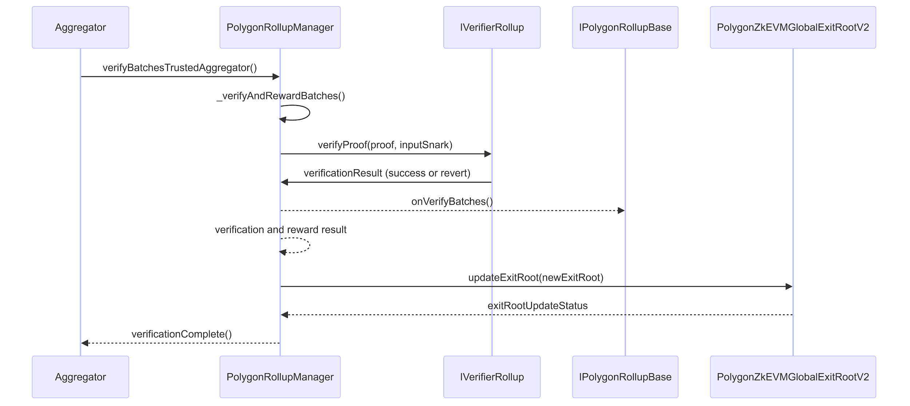

# Consensus contracts - verification

Transactions flowing through the system reach the smart contract environment after one of two contract call use-cases:

- Sequence batches requests coming from the sequencer component in the node.

- Verifying batches requests coming from the aggregator component in the node.

This section focuses on the verification workflow.

The sequence diagram below shows the verification workflow for rollup stacks and/or the AggLayer calling the `verifyBatchesTrustedAggregator(...)` function on the rollup manager.



## ```
verifyBatchesTrustedAggregator(rollupID, pendingStateNum, initNumBatch, finalNewBatch, newLocalExitRoot, newStateRoot, beneficiary, proof)
This function is called on the `PolygonRollupManager` contract.

The zkEVM node aggregator, or the AggLayer, calls the `verifyBatchesTrustedAggregator` function on the `PolygonRollupManager.sol` contract.

The function creates a rollup data storage object with the data provided by the caller, which it first verifies by sending it to the helper function `_verifyAndRewardBatches`.

This internal function calculates the inputSnark bytes value, which is a `(SHA256 % "RFIELD")` calculation on the input data, and uses this value to verify the proof by calling `rollup.verifier.verifyProof(proof, [inputSnark])` on an `IVerifierRollup` interface implementation.

```

**Note**

Using a `verifier` variable on the rollup object means the verifier implementation can be customized in the future.

Next, in the `_verifyAndRewardBatches` helper function, the code reverts if the proof does not verify successfully. Otherwise, the code pays POL rewards to the beneficiary.

The function then updates the state and calls `rollup.rollupContract.onVerifyBatches(...)`, which is a callback into the rollup consensus contract, allowing for customizable behavior. `onVerifyBatches(...)` takes the new state root and final batch, and emits a `VerifyBatches(...)` event.

The command flow returns to the `verifyBatchesTrustedAggregator` function which consolidates and updates the state with the `newStateRoot` and the new `localExitRoot` and calls the `updateExitRoot(...)` function on the `GlobalExitRootManager` contract passing the rollup’s updated exit root.
