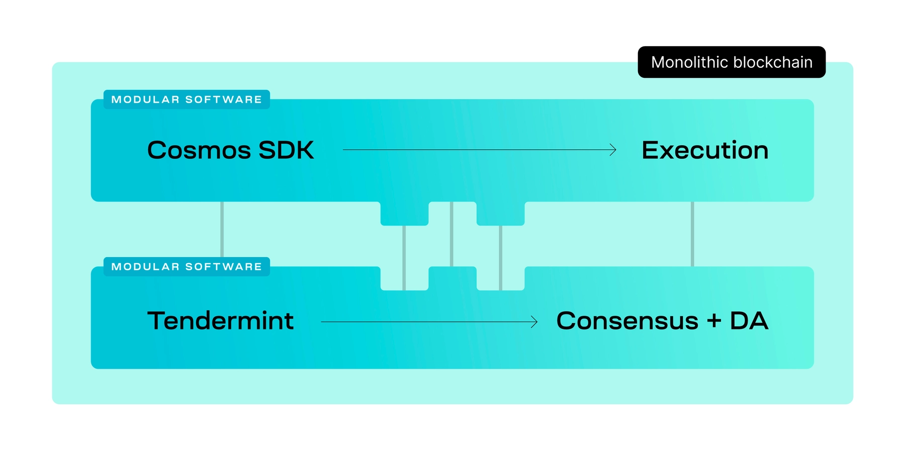

#### Summary

1.  Modular software and modular blockchains are often confused for one another, but they mean very different things
2.  Modular software separates the core functions of a blockchain among different pieces of software, enabling a more flexible and efficient blockchain development process.
3.  Modular blockchains are live blockchain networks that specialize in one or two core functions.
4.  [Rollkit](https://github.com/rollkit/rollkit) is a development kit that combines the principles of modular software and modular blockchains, enabling developers to easily deploy new blockchains with minimal overhead.

