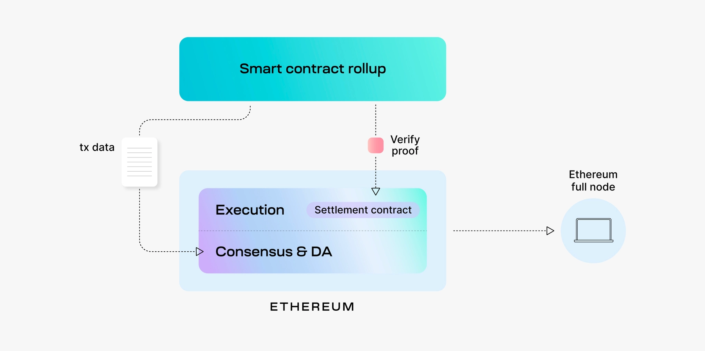
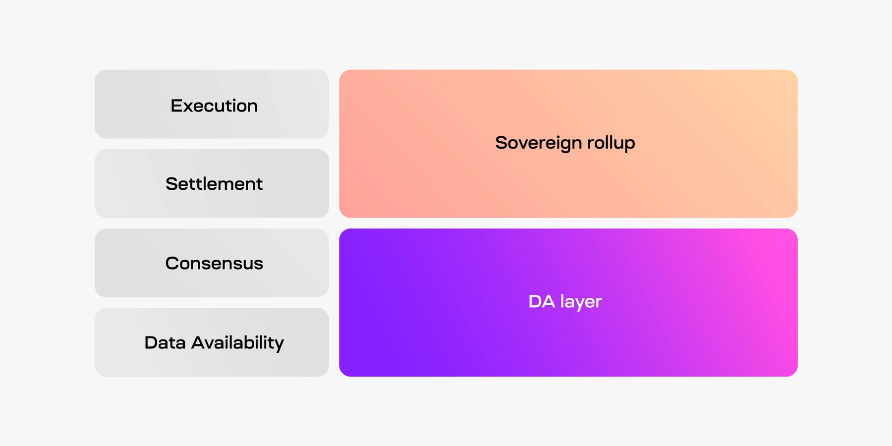
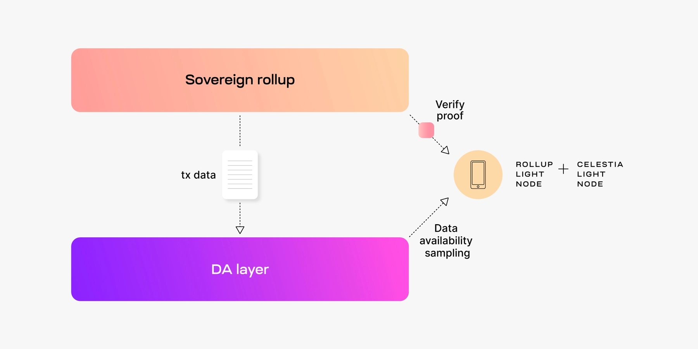

#### Summary

-   Sovereign rollups publish transactions to another blockchain for ordering and data availability, leaving its nodes to determine the correct chain.
-   The main difference between a smart contract rollup and sovereign rollup is that transactions are verified by a smart contract on Ethereum and the sovereign rollup nodes, respectively.
-   Contrary to popular belief, sovereign rollups do inherit multiple aspects of security and they can have a bridge to the DA layer.
-   

As their name implies, smart contract rollups rely on a set of smart contracts on a settlement layer, like Ethereum, to verify its blocks. The smart contracts on the settlement layer become the source of truth for determining the correct rollup chain

#### What is a sovereign rollup?

A sovereign rollup is a type of blockchain that publishes its transactions to another blockchain, typically for ordering and [data availability](https://celestia.org/glossary/data-availability/), but handles its own [settlement](https://celestia.org/learn/modular-settlement-layers/settlement-in-the-modular-stack/).

In the context of the modular stack, sovereign rollups are responsible for execution and settlement, while the DA layer handles consensus and data availability.

Uniquely, DA layers don’t verify whether sovereign rollup transactions are correct. Nodes verifying the sovereign rollup are responsible for verifying whether new transactions are correct.

Sovereign rollups typically do not have a native trust-minimized bridge with the DA layer. Although sovereign rollups can have a general bridge with the DA layer, it just isn’t used for settling the chain.