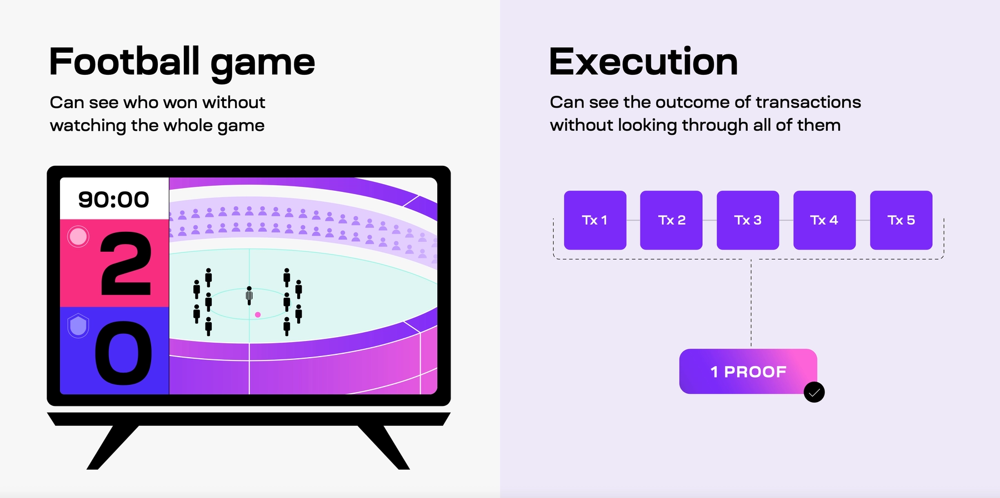

##### Modular chains let you create open access for all

But, if people can't afford to check the chain, then it's not that much different than using a centralized application. That's why it's essential to keep it inexpensive for people to confirm the blockchain is running correctly.

Technologies like data availability sampling and [fraud](https://celestia.org/glossary/state-transition-fraud-proof/) or [validity proofs](https://celestia.org/glossary/validity-proof/) are used by modular blockchains to make this possible. 

#### Summary

-   **Execution** is like playing a football game according to the rules and figuring out the final score.
-   **Settlement** is similar to solving arguments during a football game.
-   **Consensus** is like agreeing to watch the same football game as your friend.
-   **Data availability** is similar to streaming and recording a football game.
-   
-------------

#### Execution

The execution task that modular blockchains can specialize in is like playing a football game according to the rules and figuring out the final score.

After someone has gathered a bunch of transactions, the outcome is sent around the network and verified by users. Users can check the final outcome without looking through each transaction, just like fans can see the final score online without watching the entire game.

#### Settlement

The settlement task in modular blockchains is similar to solving arguments during a football game. If someone thinks that a transaction is incorrect, the blockchain stops until the disagreement is solved. If a transaction turns out to be incorrect, it gets rejected, just like a goal that doesn’t count if the striker is offside

### Consensus

The consensus task in modular blockchains works in a similar way. Transactions get ordered first. If people see different orders of the transactions, they won’t be able to agree on the right order - just like you and your friend couldn’t agree on which team won.

When people see the same order of transactions they can agree the order is correct - just like your friend agreeing on which team won after you both realized what games you were watching.