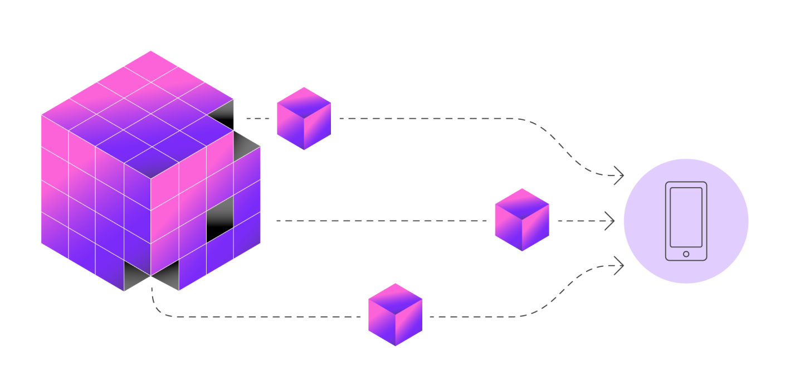

Data availability sampling (DAS) is the new primitive that enables Celestia light nodes to verify DA efficiently. Instead of downloading all data, light nodes only download a tiny portion of each block.

Importantly, DAS allows Celestia to scale with the number of users (light nodes). So, as the light node network grows over time, Celestia can scale to the data throughput needed for millions of rollups without compromising on security for end users.